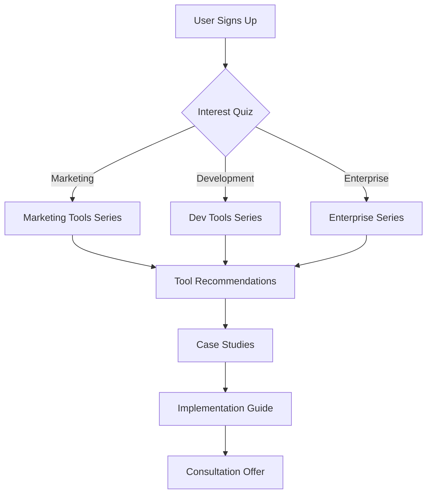

# Marketing & Growth Strategy for AI Tools Intelligence Hub

## 1. Target Audience Segments

### Primary Segments
1. **Enterprise Decision Makers**
   - CTOs, CIOs, VP of Engineering
   - Pain Points: Tool sprawl, ROI justification, integration complexity
   - Messaging: "Comprehensive analysis of 317+ AI tools to make informed decisions"

2. **IT Managers & Architects**
   - Technical evaluators, Solution architects
   - Pain Points: Security, compliance, technical integration
   - Messaging: "Deep technical comparisons with integration guides"

3. **Department Heads**
   - Marketing, Sales, HR, Finance leaders
   - Pain Points: Team productivity, budget constraints, learning curve
   - Messaging: "Find AI tools that actually work for your team"

4. **Startup Founders & SMBs**
   - Resource-constrained, need maximum impact
   - Pain Points: Cost, ease of use, quick implementation
   - Messaging: "Free and affordable AI tools that scale with you"

## 2. Content Marketing Strategy

### Pillar Content Series

#### Series 1: "The Definitive Guide to [Category]"
- Comprehensive guides for each of your 87 categories
- 3,000+ word articles with comparisons, use cases, pricing analysis
- Example: "The Definitive Guide to AI Writing Tools 2025"

#### Series 2: "Head-to-Head Comparisons"
- Popular tool comparisons (ChatGPT vs Claude, Jasper vs Copy.ai)
- Decision matrices and scoring rubrics
- Real user feedback from your database

#### Series 3: "Industry-Specific AI Playbooks"
- "AI Tools for E-commerce: Complete Implementation Guide"
- "Legal Industry AI Adoption: Tools, Risks, and Rewards"
- "Healthcare AI Solutions: HIPAA-Compliant Options"

#### Series 4: "ROI Case Studies"
- Monthly features on successful AI implementations
- Before/after metrics
- Implementation timelines and lessons learned

### Content Distribution Plan
```markdown
## Weekly Publishing Schedule

### Monday: Deep Dive Article
- Long-form guide or comparison
- Target: 2,000-3,000 words
- SEO-optimized for primary keywords

### Wednesday: Tool Spotlight
- Featured tool analysis
- Video walkthrough
- User testimonials

### Friday: Industry Roundup
- Week's AI news
- New tool launches
- Updates to existing tools

### Daily: Social Media
- Tool tip of the day
- Quick comparisons
- User success stories
```

## 3. SEO & Organic Growth

### Keyword Strategy by Intent

#### Informational Keywords (Top of Funnel)
- "what is [AI tool category]"
- "how to choose AI tools"
- "AI tools for beginners"
- "[Industry] AI solutions"

#### Comparison Keywords (Middle of Funnel)
- "[Tool A] vs [Tool B]"
- "best [category] AI tools"
- "[Tool] alternatives"
- "[Category] tools comparison"

#### Transactional Keywords (Bottom of Funnel)
- "[Tool] pricing"
- "[Tool] free trial"
- "[Tool] discount codes"
- "buy [Tool] license"

### Link Building Tactics

1. **Tool Vendor Partnerships**
   ```email
   Subject: Featured Listing on AI Tools Intelligence Hub
   
   Hi [Vendor],
   
   Your tool [Name] is featured in our database of 317+ AI solutions.
   We'd love to ensure the information is accurate and up-to-date.
   
   Would you be interested in:
   - Verifying your tool's listing
   - Providing exclusive insights for our users
   - Collaborating on a case study
   
   In return, we can offer enhanced visibility and backlinks.
   ```

2. **HARO (Help a Reporter Out)**
   - Respond to AI-related queries
   - Position as AI tools expert
   - Provide data from your 317-tool database

3. **Statistics Posts**
   - "State of AI Tools 2025: Analysis of 317 Solutions"
   - "AI Tool Pricing Trends: What We Learned from 317 Tools"
   - Create embeddable infographics

## 4. Paid Acquisition Strategy

### Google Ads Campaigns

#### Campaign 1: Competitor Comparison
- Target: "[competitor] alternatives"
- Landing Page: Filtered view showing alternatives
- Budget: $1,500/month

#### Campaign 2: Category Leaders
- Target: "best [category] tools"
- Landing Page: Category-specific comparison
- Budget: $2,000/month

#### Campaign 3: Problem-Solution
- Target: "how to [problem AI solves]"
- Landing Page: Solutions guide with tool recommendations
- Budget: $1,000/month

### LinkedIn Ads Strategy

#### Sponsored Content
- Case studies and ROI reports
- Target: Job titles, company size, industry
- Budget: $2,000/month

#### Message Ads
- Free enterprise AI report
- Target: Decision makers
- Budget: $500/month

## 5. Partnership & Community Building

### Strategic Partnerships

1. **Integration Platforms**
   - Partner with Zapier, Make, n8n
   - Create "AI Tools Stack" templates
   - Cross-promote compatible tools

2. **Consultancies**
   - AI implementation consultants
   - Referral program for recommendations
   - Co-create implementation guides

3. **Industry Associations**
   - Join AI/ML industry groups
   - Sponsor relevant conferences
   - Host webinars on tool selection

### Community Initiatives

#### AI Tools User Group
- Monthly virtual meetups
- Tool demos and Q&A
- User success stories
- Platform: Discord/Slack community

#### Expert Network
- Recruit tool experts as contributors
- Verified badge system
- Guest posts and reviews
- AMA (Ask Me Anything) sessions

## 6. Email Marketing & Automation

### Email Segments

1. **Weekly AI Digest**
   - New tools added
   - Price changes
   - Feature updates
   - Trending comparisons

2. **Category Specialists**
   - Focused updates on specific categories
   - In-depth tool reviews
   - Implementation tips

3. **Enterprise Insights**
   - ROI calculators
   - Compliance updates
   - Integration guides
   - Volume licensing deals

### Automation Flows



## 7. Metrics & KPIs

### Growth Metrics
- Monthly Unique Visitors: Target 50K by Month 6
- Email Subscribers: 10K by Month 6  
- Tool Profile Views: 100K monthly
- Comparison Tool Usage: 25K monthly

### Engagement Metrics
- Average Session Duration: >4 minutes
- Pages per Session: >3
- Newsletter Open Rate: >25%
- Community Members: 2,500 active

### Conversion Metrics
- Email Signup Rate: 5%
- Tool Clickthrough Rate: 15%
- Content Download Rate: 10%
- Partner Referrals: 50/month

## 8. Budget Allocation (Monthly)

### Paid Advertising: $6,000
- Google Ads: $4,500
- LinkedIn Ads: $1,500

### Content Creation: $3,000
- Writers: $2,000
- Design/Video: $1,000

### Tools & Software: $500
- SEO tools
- Analytics
- Email platform

### Events & Partnerships: $1,500
- Sponsorships
- Webinar platform
- Community management

**Total Monthly Budget: $11,000**

## 9. 90-Day Quick Wins

### Month 1: Foundation
- [ ] Launch 10 head-to-head comparisons
- [ ] Set up email automation
- [ ] Create 5 category guides
- [ ] Launch Google Ads

### Month 2: Expansion  
- [ ] Publish 20 tool spotlights
- [ ] Host first webinar
- [ ] Launch LinkedIn community
- [ ] Partner with 5 vendors

### Month 3: Optimization
- [ ] A/B test landing pages
- [ ] Launch referral program
- [ ] Create ROI calculator
- [ ] Publish industry report